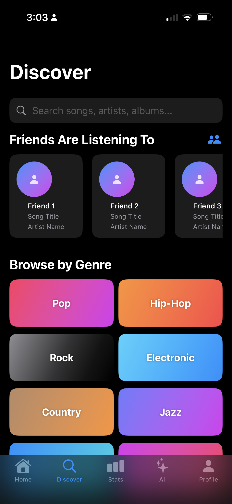
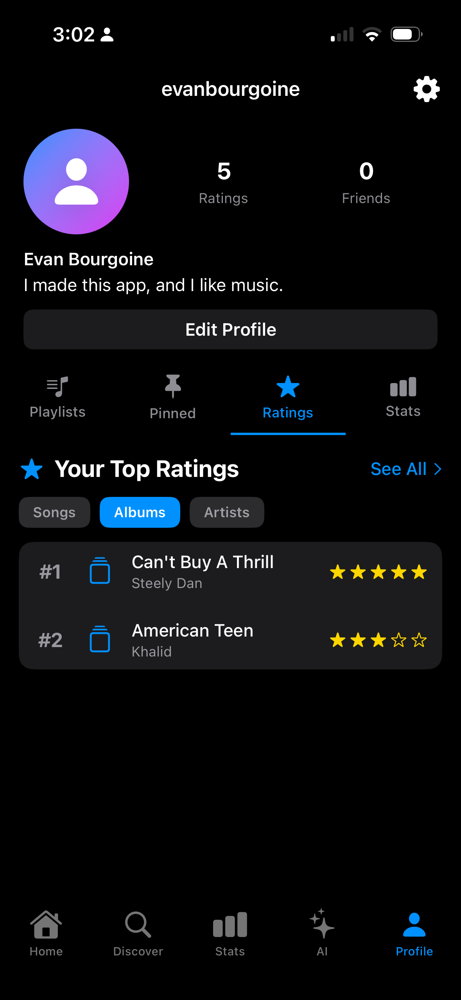
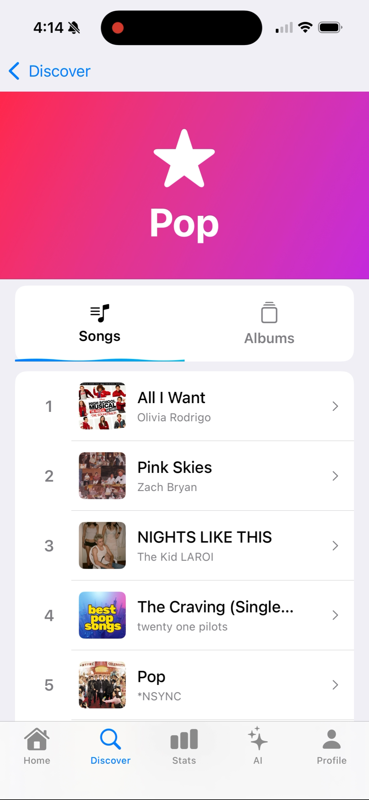

# Wave 🎵

A social music analytics iOS app that integrates with Apple Music to provide listening insights, ratings, and social features.

## 📱 Screenshots

<p align="center">
  
  
  
</p>

## ✨ Features

- 🎵 **Apple Music Integration** - Search and play from the entire catalog
- 👤 **Personal Profile** - Showcase playlists, ratings, and stats
- ⭐ **Rate Music** - Rate songs, albums, and artists (5-star system)
- 📊 **Analytics** - Track listening habits and discover trends
- 📌 **Pin Artists** - Showcase your favorite artists

## 🏗️ Architecture

### Clean, Organized Structure
```
Wave/
├── Models/          ✨ 12 focused model files
├── Services/        ✨ 5 specialized services
├── Features/
│   └── Profile/
│       └── Components/  ✨ Reusable components
└── Views/           Main app views
```

## 🎯 Tech Stack

- **Language:** Swift 5.9+
- **UI Framework:** SwiftUI
- **Backend:** Firebase (Firestore, Authentication)
- **Music API:** Apple MusicKit
- **Architecture:** MVVM with clean separation of concerns

## 🚀 Getting Started

See [SETUP.md](SETUP.md) for detailed setup instructions.

### Quick Start

1. Clone the repo
```bash
   git clone https://github.com/evanbourgoine/wave-ios.git
```

2. Add `GoogleService-Info.plist` (from Firebase Console)

3. Open in Xcode and run!

## 📸 More Screenshots

<details>
<summary>Click to see more</summary>

### Profile View


### Listening Statistics


### Pop Genre Discovery View


### Artist Profile


</details>

## 🎨 Design

- Clean, modern SwiftUI interface
- Glassmorphic design elements
- Aurora gradient accents
- Instagram-inspired profile layout
- Dark mode support

## 👨‍💻 Developer

Evan Bourgoine

## 📄 License

<<<<<<< HEAD
[Your License Here - e.g., MIT]

## 👨‍💻 Author

Evan Bourgoine

## 🙏 Acknowledgments

- Apple MusicKit for music integration
- Firebase for backend services
- SwiftUI community for inspiration
=======
[Your License]
>>>>>>> 312304d (Updated README, added screenshots)

---

**⭐ Star this repo if you like it!**
